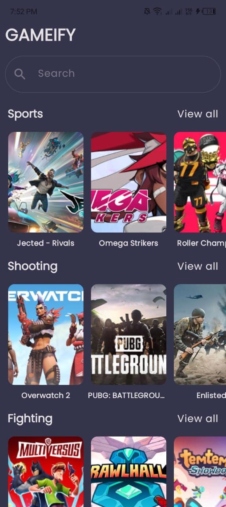
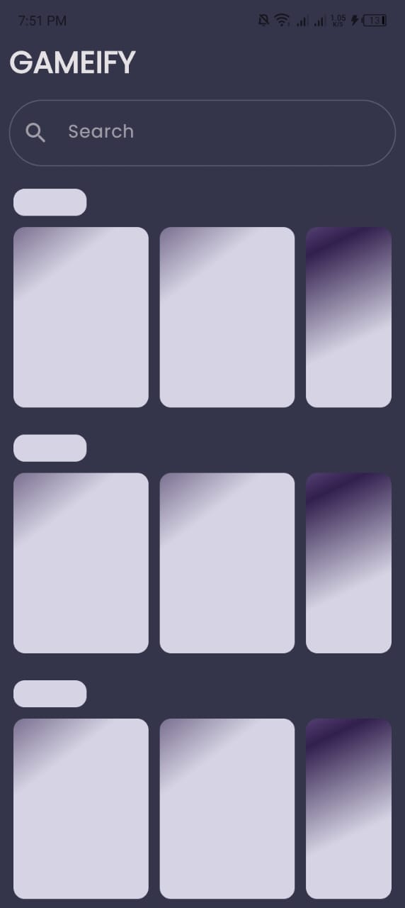
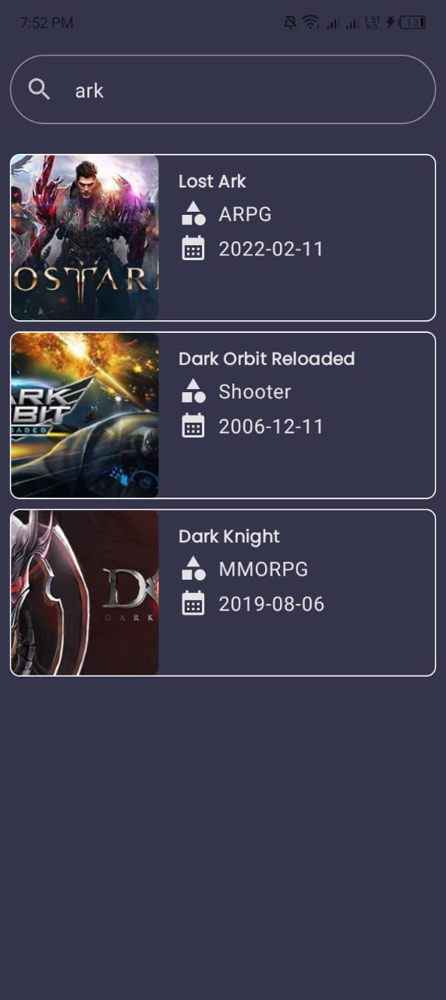
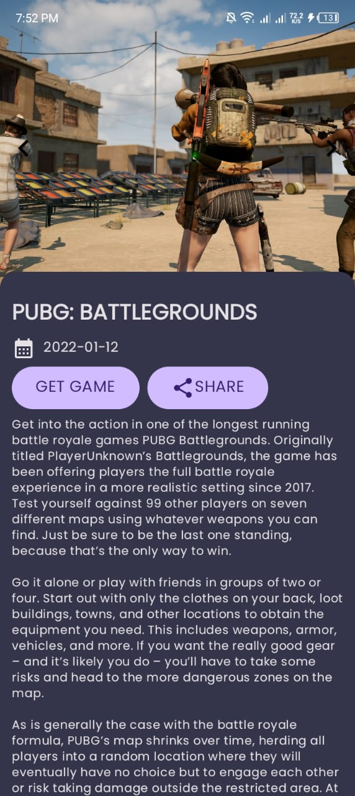

## Gameify
This is an android that fetches Games from [freeToGame](https://www.freetogame.com/api-doc) API.It allows one to check the recommendations based on categories.Also allows one to search for games.
## Model-View-ViewModel
MVVM is a software architectural pattern that separates the presentation logic (View) from the business logic (Model) and introduces a middle layer (ViewModel) to mediate communication between them. This design pattern promotes better code organization, testability, and maintainability of Android applications.

## Demo

### Home Screen

### Loading Screen

### Search Screen

### Game Screen
