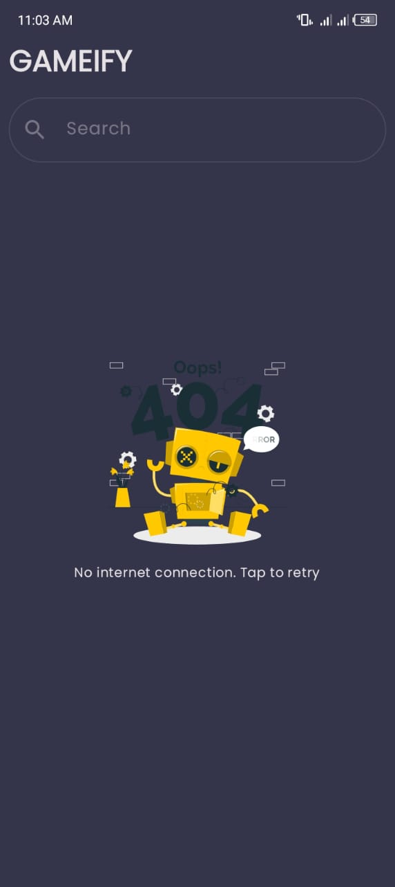
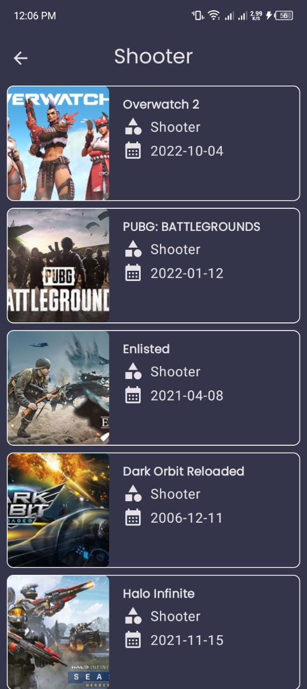
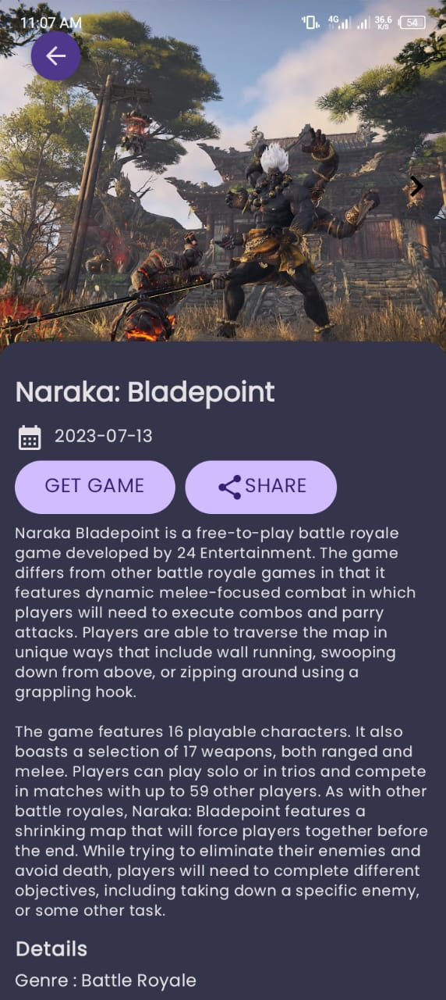
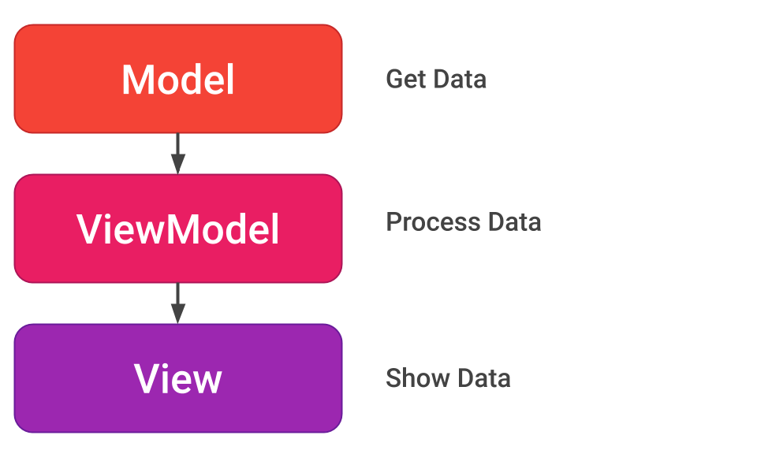

## Gameify
This is an android that fetches Games from [freeToGame](https://www.freetogame.com/api-doc) API.It allows one to check the recommendations based on categories.Also allows one to search for games.

## WIP
I am migrating the whole project to KMP. You can switch to kmp-migration branch to follow along with the journey 

## Demo
You can download the application [here](https://drive.google.com/file/d/1MCSa50GRBpQcfnBrr85DLVrz_9R-vkBp/view?usp=sharing).I will upload it to the Play Store later.

<table>
  <tr>
    <th>Loading Screen</th>
    <th>Home Screen</th>
    <th>Error Screen</th>
  </tr>
  <tr>
    <td></td>
    <td></td>
    <td></td>
  </tr>
  <tr>
    <th>Search Screen</th>
    <th>Category Screen</th>
    <th>Game Screen</th>
  </tr>
  <tr>
    <td></td>
    <td></td>
    <td></td>
  </tr>
</table>

## Model-View-ViewModel
MVVM is a software architectural pattern that separates the presentation logic (View) from the business logic (Model) and introduces a middle layer (ViewModel) to mediate communication between them. This design pattern promotes better code organization, testability, and maintainability of Android applications.

## Tech Stack
- The app is entirely written in [Kotlin](https://kotlinlang.org/)
- [Hilt](https://developer.android.com/training/dependency-injection/hilt-android) - Hilt provides a standard way to use DI in your application by providing containers for every Android class in your project and managing their lifecycles automatically.
- [Jetpack Compose](https://developer.android.com/jetpack/compose) - Jetpack Compose is Android’s modern toolkit for building native UI. It simplifies and accelerates UI development on Android. Quickly bring your app to life with less code, powerful tools, and intuitive Kotlin APIs.
- [Coroutines](https://kotlinlang.org/docs/coroutines-overview.html) - A concurrency design pattern that you can use on Android to simplify code that executes asynchronously.
- [Landscapist Image Loader](https://skydoves.github.io/landscapist/coil/imageloader/) - a Jetpack Compose image loading library which fetches and displays network images with Glide, Coil, and Fresco.
- [Retrofit](https://square.github.io/retrofit/) - A type-safe REST client for Android and Java which aims to make it easier to consume RESTful web services.
- [Kotlin Flows](https://developer.android.com/kotlin/flow) - Aids in handling streams of data asynchronously which is being executed sequentially.
- [Moshi](https://github.com/square/moshi) - a modern JSON library for Android, Java and Kotlin. It makes it easy to parse JSON into Java and Kotlin classes.
- [Timber](https://github.com/JakeWharton/timber) - Timber is a logger with a small, extensible API. It provides utility on top of android's standard Log class.
